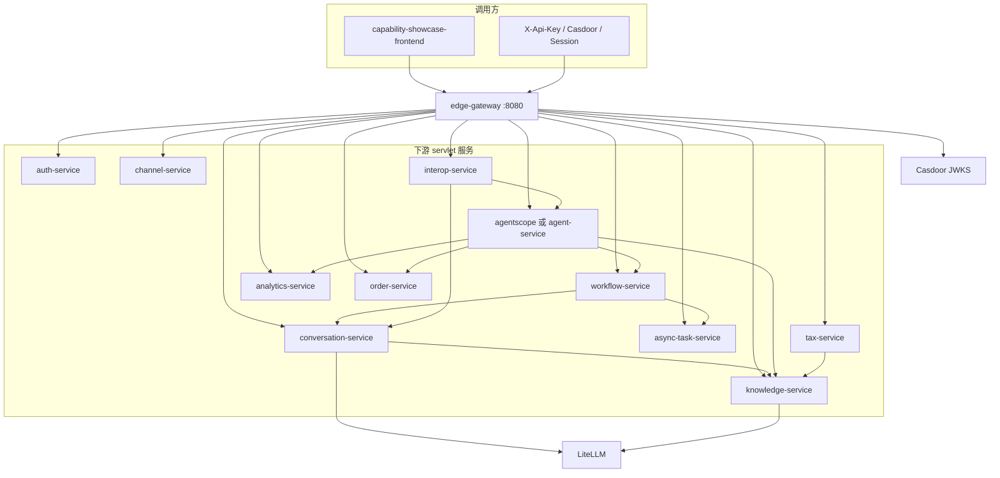
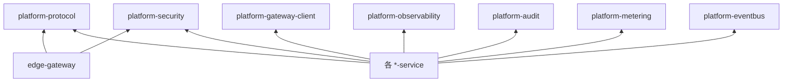

# 架构分析视图

- workspace: `/Users/liruijun/personal/LLM/langchain4j-platform`
- generated_at: 2026-09-16
- protocol: project-deep-analysis/v1
- source_of_truth: 源码（README 仅线索）
- re_run_policy: REGENERATE_OWNED_ARTIFACT
- 说明: 分析视图，不是设计阶段的 `BACKEND_ARCHITECTURE`

---

## 1. Architecture Overview

Brownfield 微服务 AI 平台：

1. **边缘 API 网关** `edge-gateway`（Spring Cloud Gateway / WebFlux :8080）是唯一对外入口。
2. **LLM 网关** LiteLLM 在 Java 进程外；`GatewayChatModelFactory` 只建 OpenAI 兼容客户端。
3. **共享内核** `platform-*` 通过 `META-INF/spring/...AutoConfiguration.imports` 注入各 servlet 服务。
4. **按限界上下文拆进程**：对话、知识、工作流、分析、任务、渠道、互操作、订单、税票等。
5. **默认 Agent 流量** 指向仓外 `agentscope-orchestrator`；本仓 `agent-service` 为整服务回滚。

风格标签（有代码才标）：微服务、网关、插件化 `@ConditionalOnProperty`、可选事件驱动、工作流引擎。不是 CQRS/Event Sourcing/Hexagonal 全套。



---

## 2. Module Topology

根 `pom.xml` 聚合 25 个模块：7 个 `platform-*` + `database-migrations` + `config-server` + 16 个服务（含 `edge-gateway`）。

前端 `capability-showcase-frontend` 不在 reactor。

Compose 另起 `agentscope-orchestrator` 镜像，不属于本 Maven 反应堆。

---

## 3. Layering

各服务大体：

```text
Controller（协议 DTO）
  → Application Service
    → 领域/编排（AiServices / Flowable / AgentAction）
      → 端口接口（Store / Client）
        → JDBC / Redis / HTTP / EmbeddingStore
```

横切：

- 入站：`InternalTokenAuthFilter`、`RequestDeadlineFilter`、`TraceIdFilter`
- 出站：`OutboundTenantForwarder`、`OutboundTraceForwarder`、`OutboundHttpResilienceInterceptor`
- LLM：`ChatModelListener`（audit / metering / otel）

edge 是 reactive filter 链，不是 servlet MVC。

---

## 4. Domain Boundaries

| 上下文 | 数据所有权 | 不跨库写 |
|---|---|---|
| 身份会话 / RBAC | `auth` | 是 |
| 对话记忆 | 默认同进程内存；语义缓存 Redis | 不持有知识正文 |
| 知识向量 | Qdrant collection-per-tenant | 是 |
| 知识图谱 | `knowledge_graph.RAG_GRAPH_TRIPLE` | 是 |
| 入库作业 | `knowledge_ingestion` | 是 |
| 文档元数据/版本 | Redis Hash registry | Redis 故障即查询门闩失效 |
| 审批 | `flowable` + `WF_*` | 是 |
| 异步任务 | `async_task` | 是 |
| 订单 | `order_service` | 只读 |
| NL2SQL 演示 | `nl2sql_demo` 只读账号 | analytics 不写 |
| 税票 | 无业务库 | 调 knowledge 检索 |

跨上下文用 HTTP/事件，不用 JOIN。

---

## 5. Dependency Relationships



- 未发现 Maven 模块循环依赖。
- 运行时环：conversation→knowledge→（可选）失效 conversation 语义缓存；workflow→conversation LLM；agent→多服务。属编排环，不是编译环。
- Java `agent-service` 与 AgentScope 是替代实现，不是互相 Maven 依赖。

---

## 6. Data Flow

主路径同步：

```text
Client → edge 换发 JWT → 服务 Controller
  →（可选）RestTemplate 下游（再 mint 内部 JWT）
  → ChatModel → LiteLLM → Provider
  → JDBC / Redis / Qdrant / ES
```

异步路径（默认多数关或仅作业内）：

- ingest `@Scheduled` worker
- WF / async-task outbox dispatcher
- `platform.eventbus.enabled=true` 时 Kafka + channel `@KafkaListener`

---

## 7. External System Dependencies

| 系统 | 用途 | 默认 |
|---|---|---|
| Casdoor | OIDC/JWKS | edge yml `enabled=true` `mode=only` |
| LiteLLM | 模型 | 必连才能真生成 |
| auth-platform :8200 | 文档 ReBAC | `RAG_AUTHZ_MODE=disabled` |
| Qdrant / ES | 检索 | knowledge yml 默认真 provider 名；embedding 可 hash |
| S3 | ingest 源 | 默认 memory |
| 钉钉/飞书 | IM | 默认关 |
| AgentScope | `/agent/**` | compose 默认 URI |

---

## 8. Middleware Dependencies

| 中间件 | 角色 | 是否权威 |
|---|---|---|
| MySQL 8.x（多库） | 业务写权威（作业、审批、任务、订单、图谱） | 是 |
| Redis | registry / 缓存 / 限流 / 预算 | registry 对「哪版可见」是查询权威；不是订单账本 |
| Kafka | 可选事件 | 默认不是主路径 |
| Elasticsearch | BM25 | 检索腿，失败变空列表 |
| Qdrant 等 | 向量 | 检索腿 |

无 Resilience4j、无 Redisson 锁、无分库中间件。

---

## 9. Deployment Architecture

- 本地：`deploy/docker-compose.yml`、`deploy/docker-compose.dev-infra.yml`、`deploy/start-*.sh`
- K8s：`deploy/helm/platform/`（Deployment、NetworkPolicy、PDB、ExternalSecret 样例、独立 migration Job）
- 配置：各服务 `application.yml` + env；edge `optional:configserver`
- 迁移：`database-migrations` 与业务进程分离
- CI：`supply-chain.yml` 全反应堆 `mvn test`（skipITs）+ SBOM + Trivy；另有 frontend / agentscope-cutover 等

edge 路由摘录（`application.yml`）：`AGENT_URI` 本地 yml 默认 `http://localhost:18085`；compose 覆盖为 `http://agentscope-orchestrator:8085`。以部署环境为准。

---

## 10. Architecture Risks

详见主报告第 17–18 节。架构层摘要：

1. 信任边界在内部 JWT：密钥与网络隔离是 P0。
2. 特征开关默认值与注释相反，运行时拓扑不等于「文档里的安全默认」。
3. Redis registry 把「可见性」放在缓存中间件上。
4. 同步 LLM+RAG 扇出是可用性热点。
5. Agent 双实现增加语义分叉。
