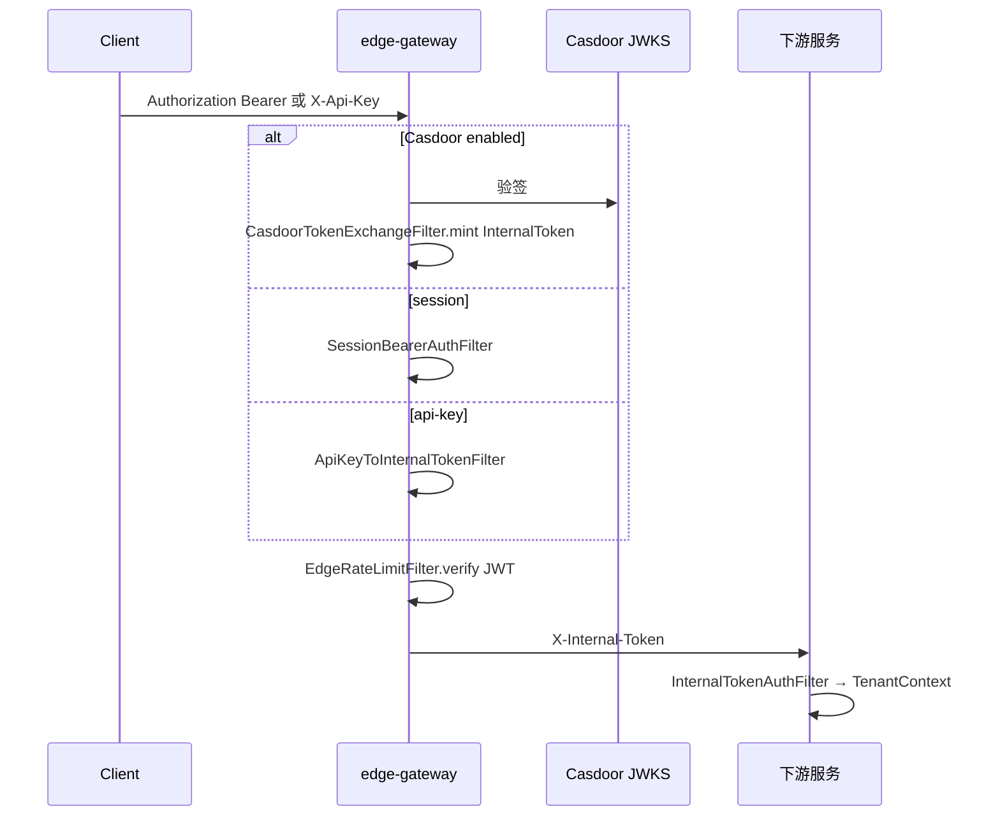
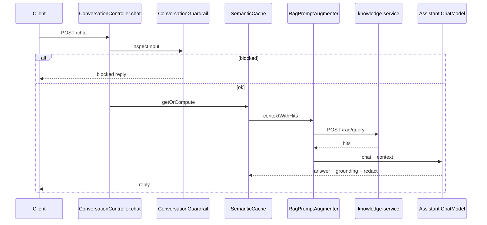
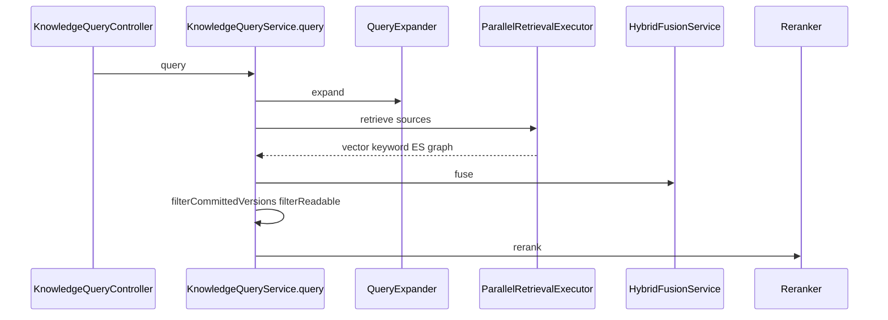
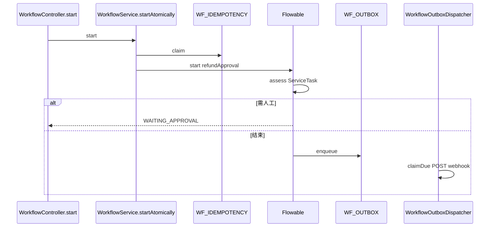

# 核心业务链路

- workspace: `/Users/liruijun/personal/LLM/langchain4j-platform`
- generated_at: 2026-09-16
- protocol: project-deep-analysis/v1
- source_of_truth: 源码（README 仅线索）
- re_run_policy: REGENERATE_OWNED_ARTIFACT

缺失的分层写 N/A，不编造。可信度：CONFIRMED / HIGH_CONFIDENCE / PARTIAL / UNCONFIRMED。

---

## Flow 1 — 边缘鉴权换发

| 项 | 内容 |
|---|---|
| 业务目标 | 把三种入站凭据变成下游只认的短时内部 JWT |
| 入口 | `*:8080` 非 `EdgeOpenPaths` |
| Controller | N/A（Gateway GlobalFilter） |
| Application / Domain | `CasdoorTokenExchangeFilter`(-120)、`SessionBearerAuthFilter`(-110)、`ApiKeyToInternalTokenFilter`(-100)、`InternalServiceTokenExchangeFilter`(-130) |
| Repository | N/A；api-key 来自 edge `platform.security.api-keys` |
| Database | N/A |
| Cache | Redis 限流（`EdgeRateLimitFilter` -90，`app.rate-limit.store` 默认 redis） |
| MQ | N/A |
| Third-party | Casdoor JWKS |
| 状态变化 | exchange attribute `VERIFIED`；写出 `X-Internal-Token` |
| 事务边界 | N/A |
| 异常路径 | ONLY 模式缺失/非法 Casdoor → 401；DUAL 透传到 session/api-key |
| 幂等 | N/A |
| 一致性 | 下游再 `InternalToken.verify` |
| 最终结果 | 路由到下游或 401 |
| 可信度 | CONFIRMED |

文件：`edge-gateway/src/main/java/com/lrj/platform/edge/CasdoorTokenExchangeFilter.java`；`platform-security/.../InternalTokenAuthFilter.java`。

---

## Flow 2 — RAG 增强对话

| 项 | 内容 |
|---|---|
| 业务目标 | 在租户隔离下回答用户，可选检索增强 |
| 入口 | `POST /chat` |
| Controller | `ConversationController.chat` |
| Application | `ConversationGuardrail` → `HistoryAwareQueryCompressor` → `SemanticCache.getOrCompute` → `RagPromptAugmenter` → `Assistant.chat` → `GroundingChecker` |
| Domain | `Assistant`（AiServices） |
| Repository | 记忆默认 in-memory；`RedisSemanticCacheStore` 可选 |
| Database | N/A（默认） |
| Cache | Redis Hash `conv:semcache:<tenantId>`，field=sha256(问题)，默认 TTL 0 |
| MQ | N/A |
| Third-party | knowledge `POST /rag/query`；LiteLLM |
| 状态变化 | 未命中缓存则回填脱敏后的答案；命中不落记忆（代码注释） |
| 事务边界 | 无跨库事务 |
| 异常路径 | 注入 block 直接返回；知识库失败空 hits 继续生成 |
| 幂等 | 无请求幂等键 |
| 一致性 | 缓存可能旧；知识更新需 `DELETE /chat/cache` 或 invalidator |
| 最终结果 | `{reply, chatId, tenantId, userId}` |
| 可信度 | CONFIRMED |

文件：`conversation-service/.../ConversationController.java`。

---

## Flow 3 — 混排知识检索

| 项 | 内容 |
|---|---|
| 业务目标 | 按租户返回相关切片，可选公开库合并与文档授权 |
| 入口 | `POST /rag/query` |
| Controller | `KnowledgeQueryController.query` |
| Application | `KnowledgeQueryService.query` |
| Domain | `RetrievalSource` 实现；`HybridFusionService`；`Reranker` |
| Repository | `EmbeddingStoreRouter.forTenant`；`EsGateway`；`JdbcGraphStore`；`RedisDocumentRegistry` |
| Database | `RAG_GRAPH_TRIPLE` |
| Cache | Redis registry（元数据，非检索缓存） |
| MQ | N/A |
| Third-party | Qdrant/Milvus 等；ES；可选 SpiceDB |
| 状态变化 | 只读 |
| 事务边界 | N/A |
| 异常路径 | 单源失败变空列表；enforce 无 docId 丢弃 |
| 幂等 | 读幂等 |
| 一致性 | 只显示 committed version |
| 最终结果 | `QueryResult` hits |
| 可信度 | CONFIRMED |

文件：`knowledge-service/.../KnowledgeQueryService.java`。

---

## Flow 4 — 异步知识入库

| 项 | 内容 |
|---|---|
| 业务目标 | API 快速受理，后台写入各检索平面后才可见 |
| 入口 | `POST /rag/ingestions` |
| Controller | `IngestionController.submit` |
| Application | `IngestionSubmissionService.submit`；`IngestionWorkerLoop.poll`；`IngestionJobWorker.process` |
| Domain | job 状态机；sink VECTOR/ES/GRAPH/AUTHORIZATION/REGISTRY |
| Repository | `IngestionJobStore`；`DocumentSourceStore`；`RedisDocumentRegistry` |
| Database | `KNOWLEDGE_INGESTION_JOB`（V1+V3） |
| Cache | Redis registry Lua `commitVersion` |
| MQ | N/A |
| Third-party | Embedding/LLM enrich；Qdrant；ES；可选 S3、SpiceDB |
| 状态变化 | PENDING→PROCESSING→SUCCEEDED/PARTIAL/FAILED/MANUAL_REVIEW |
| 事务边界 | 各 sink 独立；可见性以 registry 提交为准 |
| 异常路径 | 过期租约 reconciler；永久错误人工 |
| 幂等 | submit idempotency key；commit 同版本 Lua 幂等 |
| 一致性 | 存储可超前于可见版本 |
| 最终结果 | job id；查询侧看到新 version |
| 可信度 | CONFIRMED |

---

## Flow 5 — 退款审批

| 项 | 内容 |
|---|---|
| 业务目标 | 启动退款审批，高优先级人工，终态通知 |
| 入口 | `POST /workflow/refund/start` |
| Controller | `WorkflowController.start` |
| Application | `WorkflowService.start` / `startAtomically` |
| Domain | BPMN `refundApproval`；`ServiceTaskDelegates.assess/resolve/reject` |
| Repository | `JdbcWorkflowIdempotencyStore`；`WorkflowOutbox`；Flowable Runtime/Task/History |
| Database | `flowable` + `WF_IDEMPOTENCY` `WF_OUTBOX` `WF_REPLY` `WF_TERMINAL_EVENT_OUTBOX` |
| Cache | N/A |
| MQ | 仅 `terminal-notification.mode=kafka`（yml 默认 local） |
| Third-party | conversation/agent HTTP 调 LLM |
| 状态变化 | COMPLETED 或 WAITING_APPROVAL；outbox PENDING→DELIVERED/DEAD |
| 事务边界 | 幂等行 + 引擎 start；终态 listener 写 event outbox 同引擎事务（有单测） |
| 异常路径 | LLM degrade；4xx webhook DEAD；5xx 退避 max 6 |
| 幂等 | PK (tenant, operation, keyHash)；hash 不同 409 |
| 一致性 | 通知 at-least-once |
| 最终结果 | instanceId + status + reply |
| 可信度 | CONFIRMED |

文件：`workflow-service/.../WorkflowService.java`；`processes/refund-approval.bpmn20.xml`。

---

## Flow 6 — Agent 工具编排

| 项 | 内容 |
|---|---|
| 业务目标 | 多步工具调用完成目标 |
| 入口 | edge `/agent/**` |
| Controller | 生产：AgentScope（仓外）。回滚：`AgentController.run` → `DeepAgentService` |
| Application | ReAct 循环 `dispatch` → `AgentAction.run` |
| Domain | `AgentBrain`；动作注册表 |
| Repository | 本地任务镜像可选；权威任务可走 async-task |
| Database | 视外部服务 |
| Cache | N/A（本仓 agent 主路径） |
| MQ | N/A |
| Third-party | knowledge / analytics / workflow / order / vision HTTP |
| 状态变化 | MAX_STEPS/TIMEOUT/BUDGET/LOOP/CANCELLED/ERROR/finish |
| 事务边界 | 无跨动作 2PC；单动作 fail-soft 变 observation |
| 异常路径 | code_exec/mcp/browser 未装配则无该动作 |
| 幂等 | 视下游 |
| 一致性 | 工具副作用各自负责 |
| 最终结果 | run DTO / 异步 taskId |
| 可信度 | 路由 CONFIRMED；AgentScope 内部 UNCONFIRMED |

compose：`AGENT_URI` → `agentscope-orchestrator:8085`。`AgentCanaryRoutingFilter` 可把允许租户的 `/agent/run` 改写到候选 URI。

---

## Flow 7 — NL2SQL

| 项 | 内容 |
|---|---|
| 业务目标 | 自然语言查数，禁止写库 |
| 入口 | `POST /chat/sql`、`POST /analytics/sql` |
| Controller | `AnalyticsController.sql` |
| Application | `NlToSqlService` |
| Domain | `SqlAssistant` + `SqlQueryTool`；`SqlGuard` |
| Repository | 只读 `JdbcTemplate` |
| Database | `nl2sql_demo`，用户 `nl2sql_ro` 仅 SELECT |
| Cache | N/A |
| MQ | N/A |
| Third-party | LiteLLM |
| 状态变化 | N/A |
| 事务边界 | 只读 |
| 异常路径 | 非 SELECT / 多语句 / 禁词 → reject |
| 幂等 | 读 |
| 一致性 | N/A |
| 最终结果 | SQL 结果或拒绝 |
| 可信度 | CONFIRMED |

文件：`analytics-service/.../SqlGuard.java`。

---

## Flow 8 — 异步任务与 SSE

| 项 | 内容 |
|---|---|
| 业务目标 | 跨服务任务状态、续订流、终态 webhook |
| 入口 | `POST /async/tasks`；`GET .../stream` |
| Controller | `AsyncTaskController` |
| Application | `JdbcAsyncTaskStore`；`AsyncTaskSseService`；`AsyncTaskWebhookOutboxDispatcher` |
| Domain | `AsyncTaskStatus` PENDING→RUNNING→终态 |
| Repository | JDBC |
| Database | `ASYNC_TASK*` |
| Cache | N/A |
| MQ | `webhook.transport=kafka` 时生命周期 outbox（默认 http） |
| Third-party | 调用方 webhook URL |
| 状态变化 | lease epoch；终态入 webhook outbox |
| 事务边界 | JDBC 状态迁移 + 入队 |
| 异常路径 | epoch 冲突 409；webhook 失败重试后 DEAD |
| 幂等 | `eventKey`；终态重复 OK |
| 一致性 | at-least-once webhook |
| 最终结果 | 任务视图 / SSE 事件 |
| 可信度 | CONFIRMED |

---

## Flow 9 — A2A 真流式

| 项 | 内容 |
|---|---|
| 业务目标 | 外部 Agent 协议流式对话 |
| 入口 | `POST /interop/a2a` method `message/stream` |
| Controller | `A2aController.handle` |
| Application | `A2aStreamService.stream` → `HttpStreamingConversationGateway.streamChat` |
| Domain | A2A JSON-RPC |
| Repository | push 状态默认 memory，可 redis |
| Database | N/A |
| Cache | 可选 redis state-store |
| MQ | N/A |
| Third-party | conversation `POST /chat/stream` |
| 状态变化 | SSE 超时约 130s（类注释） |
| 事务边界 | N/A |
| 异常路径 | 下游断开取消 |
| 幂等 | N/A |
| 一致性 | N/A |
| 最终结果 | `SseEmitter` |
| 可信度 | CONFIRMED |

---

## Flow 10 — 发票风险审查

| 项 | 内容 |
|---|---|
| 业务目标 | 批次发票风险结论，模型不得改判定 |
| 入口 | `POST /tax/invoices/review` scope `tax-review` |
| Controller | `TaxInvoiceReviewController.review` |
| Application | `TaxInvoiceReviewService.review` |
| Domain | `TaxInvoiceRuleEngine` 权威；`TaxNarrator` 可选 AI |
| Repository | N/A |
| Database | 无业务表 |
| Cache | N/A |
| MQ | N/A |
| Third-party | `HttpTaxKnowledgeClient` → `/rag/query` category tax-policy；LiteLLM |
| 状态变化 | 审计事件 `TAX_INVOICE_REVIEWED` |
| 事务边界 | N/A |
| 异常路径 | RAG/AI 失败降级空证据/确定性说明 |
| 幂等 | 未见表级幂等（PARTIAL：重复提交会再审） |
| 一致性 | 规则结果不依赖 RAG |
| 最终结果 | 规则命中 + 叙事 |
| 可信度 | CONFIRMED（幂等 PARTIAL） |
