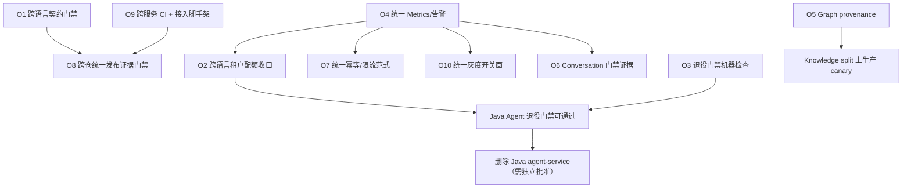

# Evolution Roadmap — langchain4j-platform（Java 半）

> 口径：langchain4j-platform 与 `agentscope-platform` 是同一产品的两半。本 Roadmap 只排 **Java 半**该做什么，
> 涉及跨语言的项标注需两仓协同。阶段顺序按「边界闭合 → 可观测 → 门禁可判定 → 平台化」，不按技术难度。

## Evolution Principles

1. **不重建已迁出的能力**：编排、Agent 评测权威在 Python；Java 只做数据、事务、安全、副作用与协议承载。
2. **先闭合边界，再加新能力**：迁出动作引入的回归（契约无门禁、配额被绕过）优先于任何新业务能力。
3. **门禁必须可机器判定**：写在 `docs/架构边界/` 的条款如果只能人工判断，就等于没有门禁。
4. **条件能力未触发不建设**：缓存、分库分表、数仓、CDC、第二套编排一律等真实证据。
5. **"工程 PASS" 不等于 "生产 GO"**：两个结论不得混写（沿用 agentscope 仓已确立的口径）。

## Capability Dependencies

关键依赖读法：`O4` 是几乎所有可靠性/治理项的前置（没有指标就无法验收）；`O2 + O3` 共同决定 Java Agent 退役门禁能否通过；`O5` 是 Knowledge 拆分拓扑上生产的硬前置。

## Phase 1 — 闭合迁出引入的回归（P0）

目标：把「Agent 编排迁出」这件事收尾，消除回归。

| 项 | 内容 | 状态 |
|---|---|---|
| O1 | 跨语言 boundary 契约在 Java 侧可校验 + `agentscope-cutover-ci.yml` 增加兼容步骤 | **DONE（2026-09-16）**，残留「副本 vs 上游最新」需制品化发布，见 `OPPORTUNITIES.md` O1 |
| O2 | 选定并落地跨语言租户配额/成本收口点 | TODO，需两仓 + 计费口径确认 |

退出条件：契约不兼容能在 PR 阶段 fail closed（**已满足**）；`/agent/**` 的模型消耗可归属到租户配额与成本（**未满足**）。

## Phase 2 — 可观测与治理底座（P1）

| 项 | 内容 | 状态 |
|---|---|---|
| O4 | `platform-observability` 统一 Micrometer→Prometheus + 关键告警，命名与 Python 低基数指标对齐 | **DONE（2026-09-16）**：registry 收进 `platform-observability`，16 个服务 actuator 迁到独立 management 端口（业务口+1000，免鉴权、只在内网），`deploy/prometheus/{prometheus,alerts}.yml` 交付 14+1 抓取目标与 8 条规则，`deploy/test-observability-config.sh` 接进 CI 防漂移 |
| O9（CI 部分） | per-service 模板化 build+test 作为 PR 必需检查 | TODO |

退出条件：模型成本、异步任务存量/孤儿回收、审批超时、入库队列老化、工具 provider 失败可在统一面板观察（**已满足**）；每个 `*-service` 有 CI gate（**未满足**，见 O9）。

未做且明确不做的部分：**没有**定 SLO。本仓没有正式性能验收目标，规则里只有可用性与异常信号，
不含延迟/TP99 门限——编造阈值等于把没验证过的东西写成验收。Kafka lag 与限流命中也未纳入：
当前 eventbus 默认内存实现、限流未注册 Micrometer 指标，属各自能力的后续变更。

## Phase 3 — 让退役门禁可判定（P1）

| 项 | 内容 | 状态 |
|---|---|---|
| O3 | `async-task-service` 存量任务/worker 归属只读盘点；`interop` 静态 fallback 显式化并默认 fail-closed | **DONE（2026-09-16）**：`GET /async/drain-inventory`（内存 + JDBC 聚合）+ `InteropToolDispatcher` 只代理 live discovery 宣告过的 agent 工具 |

退出条件：退役门禁条件 4、5 可由机器回答（**已满足**）。**注意**：门禁通过 ≠ 可删码；删除 `agent-service` 仍需真实模型 shadow/canary、演练与独立批准（见 `OPPORTUNITIES.md` N2）。

## Phase 4 — 解锁已设计但被封锁的拓扑（P2）

| 项 | 内容 | 触发条件 |
|---|---|---|
| O5 | graph 命中携带 `documentId/documentVersion`，解锁 query 角色 graph 检索与版本 GC | **DONE（2026-09-16）**：`GraphSourceId` 单点定义 `<docId>/v<version>/` provenance，图命中进入版本过滤与 enforce 判权；`RAG_GRAPH_REQUIRE_PROVENANCE` 丢弃无归属历史三元组，query 角色由「禁用图检索」改为「开则必须要求 provenance」 |
| O6 | `/chat/stream` candidate 事件面独立进程测试 + 多轮 shadow 质量报告 | 再次提出拆 conversation，或流式质量/成本出现业务诉求 |

说明：O6 的合格产出**可以是「继续不拆」**；把 HOLD 变成有依据的结论即达标。

## Phase 5 — 平台化（P2）

| 项 | 内容 | 触发条件 |
|---|---|---|
| O8 | 跨仓单一发布证据门禁（Java 门禁脚本产出结构化结果，交由统一 evidence gate 聚合） | 首次真实生产发布筹备 |
| O9（脚手架部分） | `platform-*` 新服务模板 + 接入 Checklist | 第 3 个业务线接入，或重复装配达 3 个模块 |
| O7 | 跨域统一幂等/限流接入范式 | **DONE（2026-09-16）**：入站回调幂等收口到 `InboundIdempotency` + `ProcessedEventStore`（抢占/归还语义，替换两个 bridge 各自的进程内 map）；免鉴权入口按客户端 IP 限流 |

## Future Exploration（无当前驱动，等触发）

- O10 统一灰度/回滚开关面 —— 触发：同时存在 ≥2 个按租户灰度。
- 数据能力（报表/BI/CDC/数仓）—— 触发：明确的离线分析业务需求。
- 通用只读缓存 —— 触发：O4 指标证实读热点或 DB 回源压力。

## 明确不进入 Roadmap

`OPPORTUNITIES.md` 的 N1–N7：Java 侧重建编排/评测、现在删 `agent-service`、Chat 迁进 orchestrator、通用缓存、分库分表/数仓、再造任务中心/规则引擎、为展示堆 AI。原因与重评触发条件见该文件。

## 验证状态

本轮为只读探索，**未运行** `mvn test`、未构建、未启动服务、未改任何产品代码/配置/测试/依赖。所有涉及测试与运行时的结论标记为 `UNVERIFIED`。
